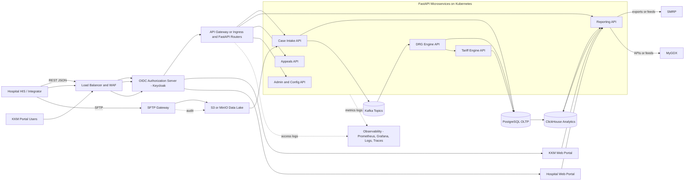
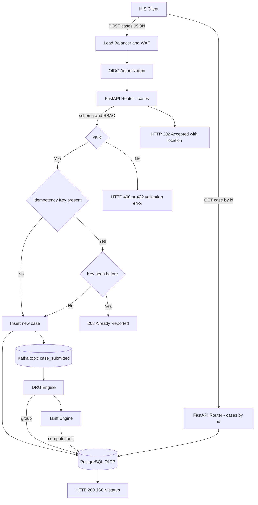

# National DRG – API E2E Flow (Tender-aligned)

## 1) High-Level E2E Flow (APIs, SFTP, Services, Data, Integrations)



---

## 2) API Lifecycle for Case Submission (Async, Idempotent)



**Notes**

* Use `Idempotency-Key` header to make `POST /cases` safe to retry.
* Prefer async: return `202 Accepted` quickly; clients poll `GET /cases/{id}` (or you can offer webhooks).

---

## 3) Batch Ingestion via SFTP (Validation, Partial Failures, Reconciliation)

```mermaid
flowchart LR
  Sender[Hospital HIS] -->|SFTP PUT| GW[SFTP Gateway]
  GW --> OBJ[S3/MinIO Landing]
  OBJ --> Scan[Antivirus/Checksum]
  Scan --> Parser[Batch Parser]
  Parser --> Val[Validation Rules]
  Val -->|OK| Load[Load Episodes]
  Val -->|Errors| Reject[Reject File / Error Manifest]
  Load --> DB[(PostgreSQL)]
  Load --> K[Kafka case.submitted]
  Reject --> REP1[Batch Status API: /batches/{id}]
  DB --> REP1
```

**Behavior**

* Accept JSON/CSV manifests.
* Produce an **error manifest** for per-row issues.
* Expose `/batches` API for status and reconciliation.

---

## 4) Reporting/Analytics API Path (Read-only)

```mermaid
flowchart LR
  User[KKM or Hospital Portal] -->|GET /reports/*| LB --> Auth
  Auth --> ReportsAPI[Reporting API]
  ReportsAPI --> DWH[(ClickHouse)]
  ReportsAPI --> Views[DB Read Views (optional)]
  DWH --> ReportsAPI
  ReportsAPI -->|CSV/PDF/JSON| User
```

**Notes**

* Heavy queries hit **ClickHouse**; OLTP read views are optional for light lookups.
* Add pagination, date filters, and tenant scoping.

---

## 5) Error Handling, Rate Limits, Retries

```mermaid
flowchart TB
  Call[Client Call] --> WAF[WAF/Rate Limit]
  WAF --> H{Within quota?}
  H -- No --> E429[429 Too Many Requests (Retry-After)]
  H -- Yes --> Svc[Service Handler]
  Svc --> OK[2xx Success]
  Svc --> C4xx[4xx Client Errors (validation/RBAC)]
  Svc --> S5xx[5xx Server Errors]
  S5xx --> Advise[Client retries with backoff; idempotency on POST]
```

---

## 6) Recommended API Surface (to wire later)

**Case Intake**

* `POST /cases` 202 Accepted (async), headers: `Authorization`, `Idempotency-Key`
* `GET /cases/{id}`
* `GET /cases?tenant_id&status&from&to&page&page_size`

**DRG/Tariff lookups**

* `GET /drg/{case_id}`
* `GET /tariffs/{case_id}`
* `GET /tariffs?drg_code&effective_date`

**Batches (SFTP companion APIs)**

* `GET /batches/{id}`
* `GET /batches/{id}/errors`
* `POST /batches/reconcile` (optional acknowledgement)

**Reports**

* `GET /reports/daily-tariffs?tenant_id&start&end&format=csv`
* `GET /reports/drg-mix?tenant_id&start&end`
* `GET /reports/system-health`

**Admin/Reference (read-mostly)**

* `GET /ref/icd10?code=...`
* `GET /ref/proc?code=...`
* `GET /ref/drg-weights?drg_code&version`
* `GET /ref/base-rate?facility_class&effective_date`

---

## 7) Security and Contract Notes (short)

* **AuthN/Z**: OIDC bearer tokens (Keycloak). Service-to-service can use mTLS.
* **Tenancy**: scope every read to `tenant_id` unless KKM role.
* **Idempotency**: require `Idempotency-Key` on all POSTs that create resources.
* **Validation**: strict JSON schema; reject unknown fields; provide error manifest for batches.
* **Versioning**: prefix `/v1/*`; avoid breaking changes; deprecate gracefully.
* **Observability**: correlation IDs on every request; structured logs; traces across LB→API→services.

