Great 👍 Let’s map this into a **C4 Model** (used in architecture proposals).
I’ll give you two levels:

---

# **C4 Context Diagram (Level 1)**

Shows the **big picture**: who uses the system and how data flows.

---

# **C4 Container Diagram (Level 2)**

Zooms inside the **National DRG System** to show **microservices & data stores**.

```mermaid
flowchart LR
    subgraph DRGSystem["☁️ National DRG System (MyGovCloud@CFA)"]
        LB["🌐 Load Balancer + WAF"]

        subgraph K8s["☸️ Kubernetes Cluster"]
            Intake["📥 Case Intake Service (FastAPI)"]
            DRG["🧮 DRG Grouping Service (FastAPI + Rules)"]
            Tariff["💰 Tariff Engine (FastAPI)"]
            Report["📊 Reporting & Analytics (FastAPI + BI)"]
            Auth["🔑 Identity & Access (Keycloak)"]
            AI["🤖 AI/ML Service (Python/MLflow)"]
        end

        subgraph Data["🗄️ Data Layer"]
            DB[(PostgreSQL - Transactions)]
            DWH[(ClickHouse - Analytics)]
            DL[(S3/MinIO - Data Lake)]
        end
    end

    Hospital["🏥 Hospital HIS"] -->|API/SFTP| LB
    SMRP["📡 SMRP"] -->|Batch Data| LB
    MyGDX["📡 MyGDX"] -->|API| LB

    LB --> Intake
    Intake --> DRG --> Tariff --> Report
    Intake --> DB
    DRG --> DB
    Tariff --> DB
    Report --> DWH
    DB --> DWH
    DWH --> DL

    Report -->|"Dashboards"| Hospital
    Report -->|"Funding & Analytics"| KKM["🏛️ KKM HQ"]
```

---

✅ These two diagrams (Context + Container) give you:

* **Level 1 (Context):** Who interacts (Hospitals, KKM, Insurers, SMRP, MyGDX).
* **Level 2 (Container):** How the system is broken into **microservices (FastAPI)**, **data stores**, and **integration points**.

---

@startuml
!include https://raw.githubusercontent.com/plantuml-stdlib/C4-PlantUML/master/C4_Container.puml

title National DRG System (MyGovCloud@CFA) – Container Diagram

' External Systems
Person(hosp, "Hospital HIS", "Sends patient data via API/SFTP and receives DRG + Tariff results")
Person(kkm, "KKM HQ", "Monitors national DRG data and performs funding analytics")
System_Ext(smrp, "SMRP", "Sistem Maklumat Rawatan Pesakit – national patient data warehouse")
System_Ext(mygdx, "MyGDX", "MyGov Data Exchange – inter-agency data exchange platform")

' System Boundary
System_Boundary(drg, "National DRG System (MyGovCloud@CFA)") {

  Container(lb, "Load Balancer + WAF", "NGINX / Cloud LB", "Routes API and SFTP traffic; TLS termination & WAF")

  Container_Boundary(k8s, "Kubernetes Cluster") {
    Container(intake, "Case Intake Service", "FastAPI", "Receives case data, validates, forwards to DRG Engine")
    Container(drg_engine, "DRG Grouping Service", "FastAPI + Rules", "Groups cases into DRG categories")
    Container(tariff, "Tariff Engine", "FastAPI", "Calculates tariff based on cost weight × base rate")
    Container(report, "Reporting & Analytics", "FastAPI + BI", "Generates dashboards for hospitals and KKM")
    Container(auth, "Identity & Access", "Keycloak", "Authentication, RBAC for KKM & hospitals")
    Container(ai, "AI/ML Service", "Python + MLflow", "Anomaly detection, auto-coding, cost prediction")
  }

  Container_Boundary(data, "Data Layer") {
    ContainerDb(db, "PostgreSQL", "Relational DB", "Transactional DRG and tariff data")
    ContainerDb(dwh, "ClickHouse", "Columnar DB", "Analytics warehouse for national reporting")
    ContainerDb(dl, "S3 / MinIO", "Object Storage", "Raw data lake, logs, backups")
  }
}

' Relationships
Rel(hosp, lb, "Sends API / SFTP data")
Rel(smrp, lb, "Sends batch case data")
Rel(mygdx, lb, "Exchanges inter-agency data")
Rel(lb, intake, "Routes requests")
Rel(intake, drg_engine, "Validates and forwards case")
Rel(drg_engine, tariff, "Requests tariff calculation")
Rel(tariff, report, "Sends results for reporting")
Rel(ai, report, "Provides AI insights")
Rel(auth, intake, "Authorises")
Rel(auth, drg_engine, "Authorises")
Rel(auth, tariff, "Authorises")
Rel(auth, report, "Authorises")
Rel(intake, db, "Writes case data")
Rel(drg_engine, db, "Updates DRG results")
Rel(tariff, db, "Updates tariff results")
Rel(report, dwh, "Loads analytical data")
Rel(db, dwh, "ETL sync")
Rel(dwh, dl, "Stores raw files")
Rel(report, hosp, "Delivers DRG & Tariff results")
Rel(report, kkm, "Delivers dashboards & funding analytics")

@enduml

Would you like me to now prepare a **PPTX deck** that includes:

1. Context Diagram
2. Container Diagram
3. Microservices Workflow (previous one)
4. Responsibilities (Hospital vs KKM vs Vendor)

So you can use it directly for **tender submission / stakeholder demo**?

