Great 👍 Let’s map this into a **C4 Model** (used in architecture proposals).
I’ll give you two levels:

---

# **C4 Context Diagram (Level 1)**

Shows the **big picture**: who uses the system and how data flows.

```mermaid
flowchart LR
    Hospital["🏥 Hospital HIS\n(Doctors, Coders, Finance)"]
    KKM["🏛️ KKM HQ\n(Admin, Finance, Analysts)"]
    Insurer["💼 Insurers / Panel Companies"]
    SMRP["📡 SMRP\n(Patient Data Warehouse)"]
    MyGDX["📡 MyGDX\n(Gov Data Exchange)"]

    subgraph DRGSystem["☁️ National DRG System (MyGovCloud@CFA)"]
        Portal["🌐 Web Portal\n(Hospitals & KKM)"]
        API["🔗 REST/SFTP APIs"]
    end

    Hospital -->|Submit Cases\n(API/SFTP)| DRGSystem
    DRGSystem -->|DRG Codes + Tariffs| Hospital
    DRGSystem -->|Funding & Analytics| KKM
    DRGSystem -->|Claims Data| Insurer
    DRGSystem -->|Data Exchange| SMRP
    DRGSystem -->|Inter-agency Data| MyGDX
```

---

# **C4 Container Diagram (Level 2)**

Zooms inside the **National DRG System** to show **microservices & data stores**.

```mermaid
flowchart LR
    subgraph DRGSystem["☁️ National DRG System (MyGovCloud@CFA)"]
        LB["🌐 Load Balancer + WAF"]

        subgraph K8s["☸️ Kubernetes Cluster"]
            Intake["📥 Case Intake Service (FastAPI)"]
            DRG["🧮 DRG Grouping Service (FastAPI + Rules)"]
            Tariff["💰 Tariff Engine (FastAPI)"]
            Report["📊 Reporting & Analytics (FastAPI + BI)"]
            Auth["🔑 Identity & Access (Keycloak)"]
            AI["🤖 AI/ML Service (Python/MLflow)"]
        end

        subgraph Data["🗄️ Data Layer"]
            DB[(PostgreSQL - Transactions)]
            DWH[(ClickHouse - Analytics)]
            DL[(S3/MinIO - Data Lake)]
        end
    end

    Hospital["🏥 Hospital HIS"] -->|API/SFTP| LB
    SMRP["📡 SMRP"] -->|Batch Data| LB
    MyGDX["📡 MyGDX"] -->|API| LB

    LB --> Intake
    Intake --> DRG --> Tariff --> Report
    Intake --> DB
    DRG --> DB
    Tariff --> DB
    Report --> DWH
    DB --> DWH
    DWH --> DL

    Report -->|"Dashboards"| Hospital
    Report -->|"Funding & Analytics"| KKM["🏛️ KKM HQ"]
```



---

✅ These two diagrams (Context + Container) give you:

* **Level 1 (Context):** Who interacts (Hospitals, KKM, Insurers, SMRP, MyGDX).
* **Level 2 (Container):** How the system is broken into **microservices (FastAPI)**, **data stores**, and **integration points**.

---

Would you like me to now prepare a **PPTX deck** that includes:

1. Context Diagram
2. Container Diagram
3. Microservices Workflow (previous one)
4. Responsibilities (Hospital vs KKM vs Vendor)

So you can use it directly for **tender submission / stakeholder demo**?
