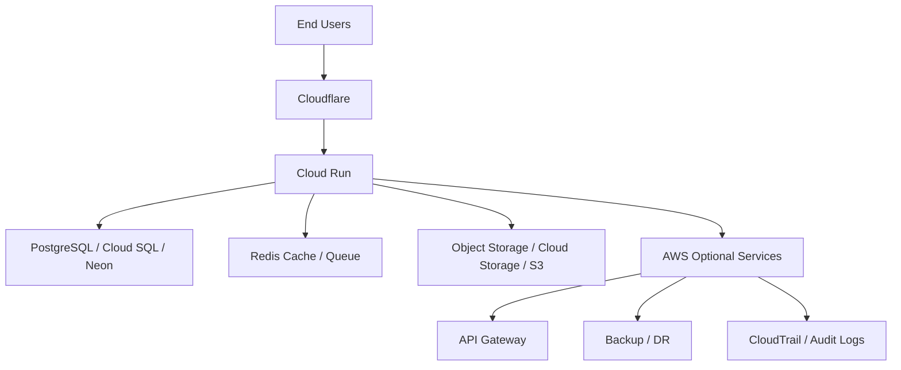

# 🏗️ Hybrid Cloud Architecture Overview

## 🎯 Architecture Summary

A hybrid model combining:
- Our managed infrastructure (core application)
- Select AWS services where required

## 🧱 High-Level Architecture

## 🔄 Data Flow

1. Users access the platform through Cloudflare.
2. Cloudflare handles DNS, CDN, WAF, and DDoS protection.
3. Requests are routed to Cloud Run services.
4. Application services interact with:
   - PostgreSQL for transactional data
   - Redis for cache and queue workloads
   - Object storage for files and documents
5. Optional AWS services are used only where they add value.

## 🔐 Security Layers

- Edge security via Cloudflare
- Application security via authentication and RBAC
- Data security via encryption and tenant isolation

## ⚙️ Deployment Flow

- Source control: GitHub
- CI/CD: GitHub Actions or Cloud Build
- Runtime: Cloud Run
- Data layer: PostgreSQL, Redis, Object Storage

## 🎯 Key Benefits

- Lower cost
- Reduced architectural duplication
- Strong scalability
- Faster deployments
- Better control over core infrastructure
