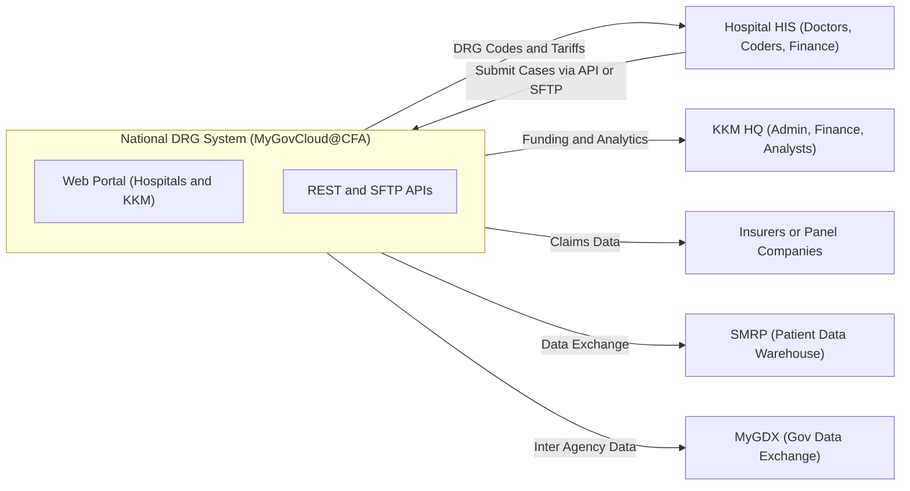
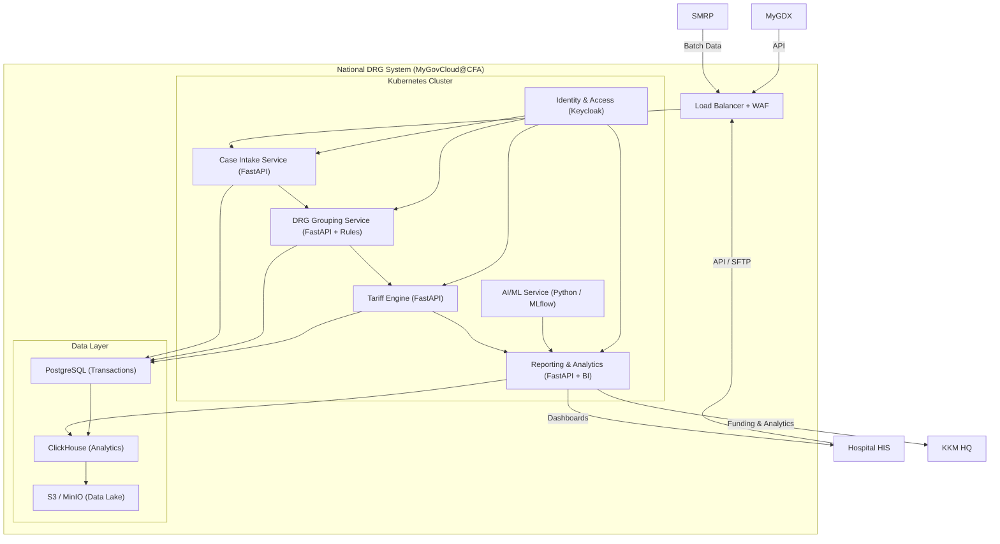
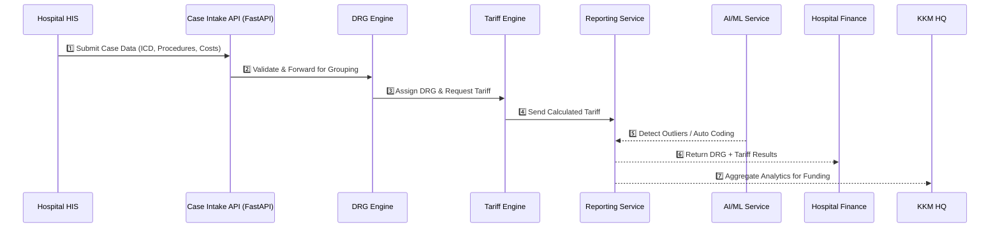

# 🏥 National DRG System (MyGovCloud@CFA)

*Architecture Overview for Tender Submission & Stakeholder Review*

---

## 1️⃣ **C4 Context Diagram (Level 1)**

Shows how the National DRG System connects to hospitals, KKM, and other government systems.

---

## 2️⃣ **C4 Container Diagram (Level 2)**

Zooms inside the National DRG System to show the microservices, integrations, and data stores.

---

## 3️⃣ **Microservices Workflow**

Step-by-step workflow for DRG processing and reporting.

---

## 4️⃣ **Responsibilities (RACI Matrix)**

| **Task**                        | **Vendor**    | **Hospital**  | **KKM**        |
| ------------------------------- | ------------- | ------------- | -------------- |
| Build DRG system (engine, APIs) | ✅ Responsible | 🔹 Informed   | 🔹 Accountable |
| Provide API documentation       | ✅ Responsible | 🔹 Consulted  | 🔹 Accountable |
| Integrate HIS with DRG system   | 🔹 Consulted  | ✅ Responsible | 🔹 Accountable |
| Upload case data                | 🔹 Informed   | ✅ Responsible | 🔹 Accountable |
| Run DRG grouping + tariffs      | ✅ Responsible | 🔹 Informed   | 🔹 Accountable |
| National monitoring & funding   | 🔹 Informed   | 🔹 Informed   | ✅ Responsible  |
| Analytics & reporting           | 🔹 Consulted  | 🔹 Informed   | ✅ Responsible  |
| Security & compliance oversight | ✅ Responsible | 🔹 Informed   | 🔹 Accountable |

---

## 📘 Summary

* **Hospitals** submit case data and receive DRG results.
* **KKM** monitors, analyses, and allocates funding fairly.
* **Vendor** builds, secures, and maintains the national system.
* Architecture uses **FastAPI microservices**, **Kubernetes**, and **MyGovCloud@CFA** for scalability, compliance, and interoperability with **SMRP** and **MyGDX**.
