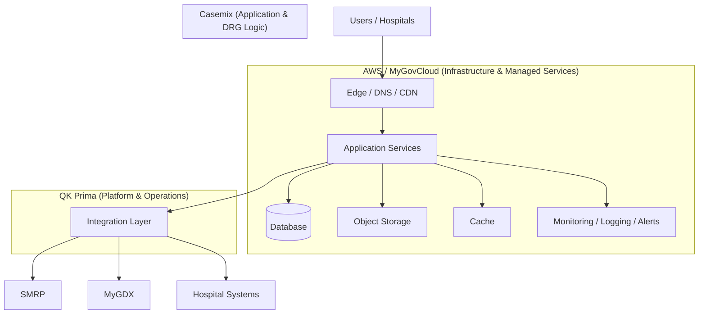

# 🏗️ Platform Architecture — Responsibility View (AWS / Casemix / QK Prima)

## 🎯 Overview
Architecture is hosted on **MyGovCloud (AWS-backed)**.  
This diagram highlights **responsibility boundaries**.

---

## 🧱 Architecture (Mermaid)

---

## 🧠 Responsibility Summary

| Layer | Owner |
|------|------|
| Infrastructure (compute, storage, network) | AWS / MyGovCloud |
| Application (DRG logic, modules) | Casemix |
| Platform (integration, ops, governance) | QK Prima |

---

## 🎯 Final Statement

> The platform layer connects, governs, and operates the system on AWS.
