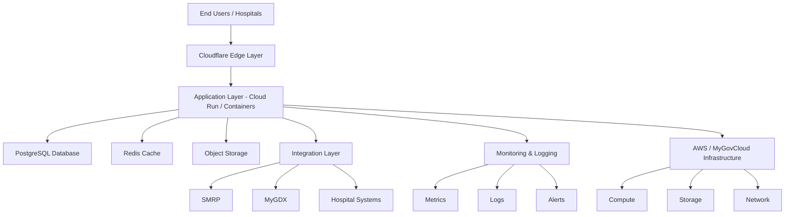

# 🏗️ Hybrid Platform Architecture — DRG System

## 🎯 Overview

This architecture represents a **hybrid cloud model**:

- MyGovCloud (AWS-backed infrastructure)
- Platform layer managed by QK Prima
- Application layer provided by Casemix

---

## 🧱 High-Level Architecture

---

## 🔄 Data Flow

1. Users access system via Cloudflare  
2. Requests routed to application layer  
3. Application interacts with:
   - Database (PostgreSQL)
   - Cache (Redis)
   - Storage (files, reports)

4. Integration layer handles:
   - SMRP
   - MyGDX
   - External hospital data

---

## 🔐 Security Layers

- Edge: Cloudflare (WAF, DDoS)
- Application: Authentication + RBAC
- Data: Encryption (at rest & in transit)

---

## ⚙️ Deployment Flow

- Code → GitHub
- CI/CD → GitHub Actions / Cloud Build
- Deployment → Cloud Run / Containers
- Runtime → Auto-scaled services

---

## 🎯 Key Design Principles

- No duplication of services
- Cloud-native architecture
- Multi-tenant readiness
- High availability
- Observability-first design

---

## 🧠 Responsibility View

| Layer | Owner |
|------|------|
| Infrastructure | AWS / MyGovCloud |
| Platform | QK Prima |
| Application | Casemix |

---

## 🚀 Final Statement

> The cloud provides the foundation.  
> The platform ensures the system runs reliably at scale.
