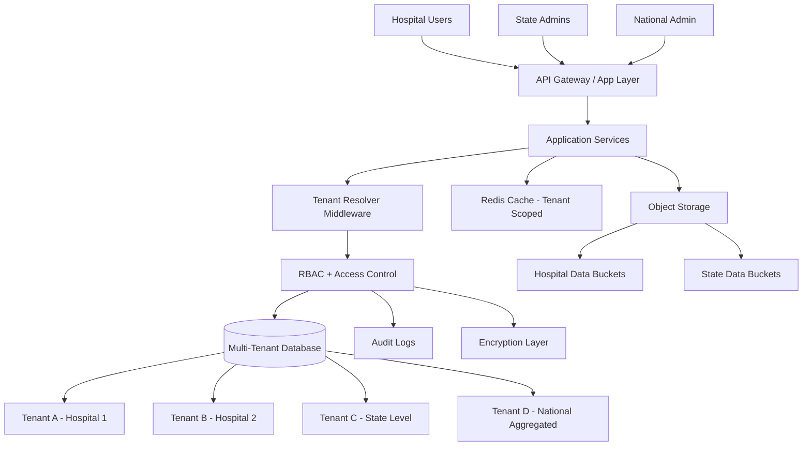

# 🏢 Multi-Tenant Architecture — National DRG Platform

## 🎯 Overview

This architecture ensures **strict data isolation** across:

- Hospitals
- States
- Organisations

While using a **shared infrastructure model**.

---

## 🧱 Multi-Tenant Architecture Diagram

---

## 🔐 Key Principles

### 1. Tenant Isolation
- Each hospital/state acts as a **logical tenant**
- Data is separated using:
  - `tenant_id`
  - Access policies

---

### 2. Role-Based Access (RBAC)

| Role | Access |
|------|--------|
| Hospital User | Own data only |
| State Admin | State-level aggregation |
| National Admin | Full dataset |

---

### 3. Data Protection

- Encryption at rest
- Encryption in transit
- Audit logs for all access

---

## ⚠️ Critical Risk (If Not Implemented)

- Data leakage across hospitals
- Compliance violation
- National-level risk

---

## 🎯 Final Statement

> Multi-tenancy is not optional.  
> It is a **core requirement for national-scale DRG systems**.
