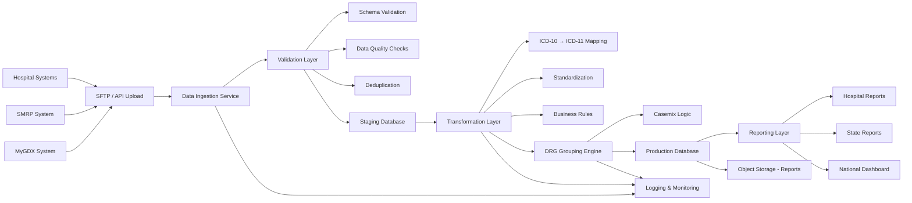

# 🔄 DRG Data Flow Architecture — National System

## 🎯 Overview

This diagram represents the **end-to-end data lifecycle**:

From hospital systems → DRG processing → national analytics.

---

## 🧱 DRG Data Flow Diagram

---

## 🔄 Data Flow Steps

### 1. Data Sources
- Hospital systems
- SMRP
- MyGDX

---

### 2. Ingestion
- API / SFTP
- Batch & real-time

---

### 3. Validation
- Schema checks
- Data completeness
- Deduplication

---

### 4. Staging
- Temporary storage
- Pre-processing

---

### 5. Transformation
- ICD mapping
- Data standardization
- Business rules

---

### 6. DRG Processing
- Casemix grouping engine
- Clinical logic applied

---

### 7. Storage
- Production database
- Object storage for reports

---

### 8. Reporting
- Hospital-level
- State-level
- National-level

---

## ⚠️ Critical Risk Areas

- Data quality issues
- Incorrect ICD mapping
- Integration failures
- Processing delays

---

## 🎯 Strategic Insight

> The DRG system is not just an application.  
> It is a **data pipeline + clinical processing system**.

---

## 🚀 Final Statement

> The success of the DRG platform depends on  
> accurate, validated, and properly processed data —  
> not just infrastructure.
