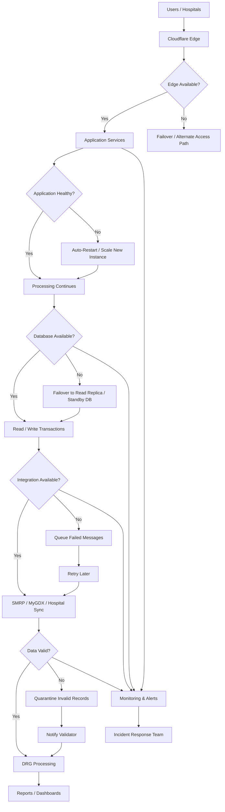

# ⚠️ Failure Scenario Architecture — National DRG Platform

## 🎯 Purpose

This diagram shows how the platform should handle common failure scenarios without compromising national DRG operations.

---

## 🧱 Failure Scenario Diagram

---

## 🔥 Key Failure Scenarios Covered

| Failure Area | Platform Response |
|-------------|-------------------|
| Edge / access issue | Alternate routing or failover |
| Application crash | Auto-restart and scaling |
| Database issue | Standby / replica failover |
| Integration failure | Queue and retry |
| Invalid data | Quarantine and validation workflow |
| Performance degradation | Monitoring and alerting |

---

## 🧠 Operational Principle

The platform must not fail silently.

Every failure must trigger:
- detection
- logging
- alerting
- containment
- recovery action

---

## 🎯 Final Statement

> A national DRG system must be designed for controlled degradation, not uncontrolled failure.
