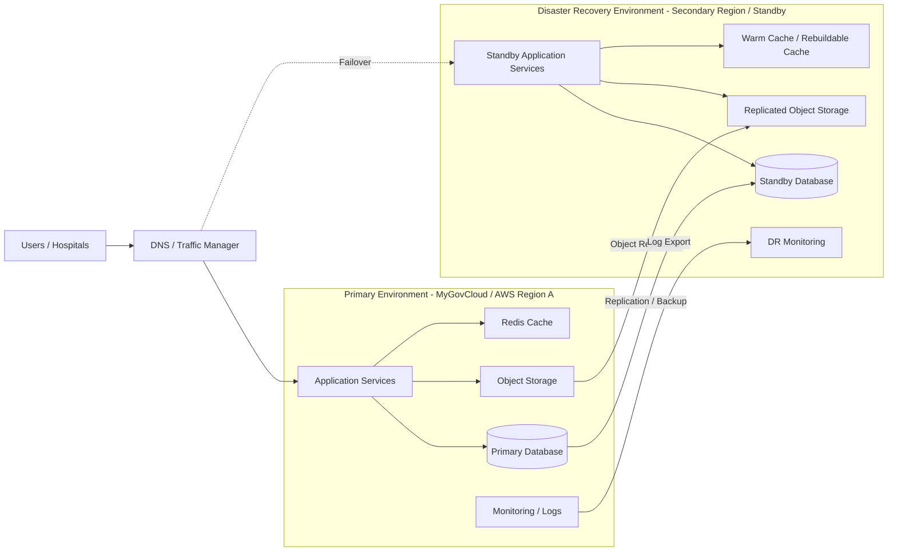

# 🛡️ Disaster Recovery Architecture — National DRG Platform

## 🎯 Purpose

This diagram defines how the DRG platform can recover from major infrastructure or regional failure while protecting data integrity and service continuity.

---

## 🧱 Disaster Recovery Architecture Diagram

---

## 🔄 DR Flow

### Normal Operation
1. Users access the primary environment.
2. Application writes to the primary database.
3. Data is backed up or replicated.
4. Object storage is replicated.
5. Logs are exported for audit and incident review.

---

### Disaster Scenario
1. Primary environment becomes unavailable.
2. DNS / traffic manager redirects access to standby environment.
3. Standby application services are activated.
4. Standby database is promoted.
5. System resumes under DR mode.

---

## 📌 Recovery Targets

| Metric | Meaning | Required Action |
|-------|---------|----------------|
| RTO | Recovery Time Objective | Define maximum acceptable downtime |
| RPO | Recovery Point Objective | Define maximum acceptable data loss |
| Backup Frequency | How often backups occur | Align with criticality |
| DR Test Frequency | How often DR is tested | Must be scheduled |

---

## 🔐 DR Security Requirements

- Encrypted backups
- Controlled access to DR environment
- Audit logs retained
- DR access tested and documented
- Recovery procedures approved

---

## ⚠️ Critical Notes

- Redis cache should be treated as rebuildable.
- Database and object storage require formal replication / backup strategy.
- DR must be tested before production go-live.
- DR documentation must be maintained throughout the 36-month lifecycle.

---

## 🎯 Final Statement

> Disaster recovery is not just backup.  
> It is the ability to restore service, data, access, and trust within agreed recovery targets.
