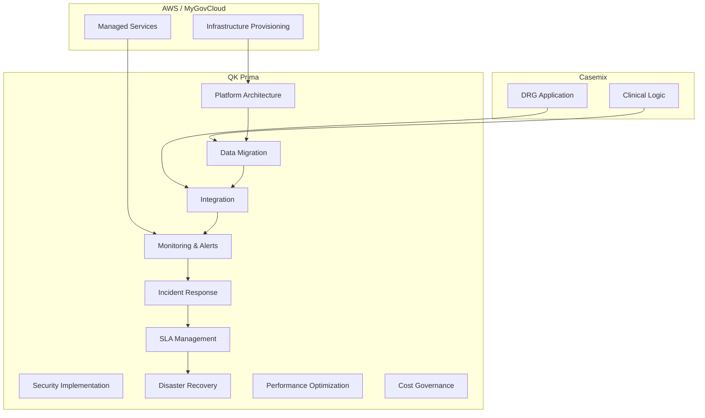

# 📊 RACI Visual Diagram — DRG Platform

## 🎯 Overview

This diagram provides a **visual responsibility distribution** across:

- AWS (Infrastructure)
- Casemix (Application)
- QK Prima (Platform & Operations)

---

## 🧱 RACI Diagram

---

## 🎯 Key Insight

- AWS = Provides infrastructure
- Casemix = Provides application
- QK Prima = Responsible for all platform outcomes

---

## 🚀 Final Statement

> Responsibility is concentrated at the platform layer, ensuring system success.
