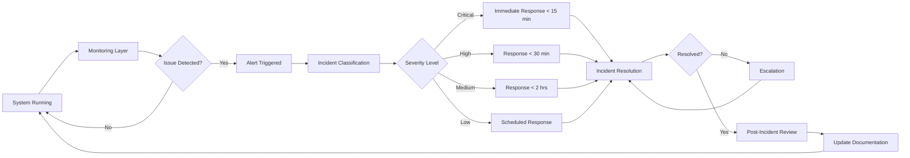

# 📈 SLA Visual Diagram — DRG Platform Operations

## 🎯 Overview

This diagram illustrates the **end-to-end SLA lifecycle**, from monitoring to resolution.

---

## 🧱 SLA Lifecycle Diagram

---

## 📊 SLA Metrics (Reference)

| Severity | Response Time | Resolution Target |
|----------|--------------|------------------|
| Critical | < 15 min | < 4 hours |
| High | < 30 min | < 8 hours |
| Medium | < 2 hours | < 24 hours |
| Low | < 1 day | Scheduled |

---

## 🧠 Operational Principle

- Detect early  
- Respond quickly  
- Resolve effectively  
- Learn continuously  

---

## 🚀 Final Statement

> SLA is not just response — it is a continuous cycle of monitoring, action, and improvement.
