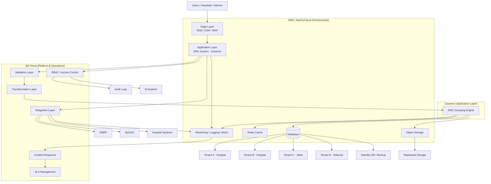

# 🏗️ Master Architecture — National DRG Platform (AWS-Aligned)

## 🎯 Overview

This diagram represents the **complete DRG platform architecture**, showing:

- Infrastructure (AWS / MyGovCloud)
- Application (Casemix)
- Platform & Operations (QK Prima)

---

## 🧱 Master Architecture Diagram



---

## 🧠 Responsibility Summary

| Layer | Owner |
|------|------|
| Infrastructure | AWS / MyGovCloud |
| Application (DRG logic) | Casemix |
| Platform (integration, ops, governance) | QK Prima |

---

## 🔄 Key Flows

### 1. User Access
Users → Edge → Application

---

### 2. Data Flow
Integration → Validation → Transformation → DRG Engine → Storage

---

### 3. Multi-Tenant
Single platform, logically separated data per:
- Hospital
- State
- National

---

### 4. Observability
All layers feed:
- Logs
- Metrics
- Alerts → Incident → SLA

---

### 5. Security
- RBAC enforced at platform layer
- Encryption at all levels
- Full audit trail

---

### 6. Disaster Recovery
- Database replication
- Object storage replication
- Failover capability

---

## 🎯 Design Principles

- AWS-native deployment
- Clear responsibility separation
- Platform-driven operations
- Data-first architecture
- Compliance-ready
- Scalable to national level

---

## 🚀 Final Statement

> AWS provides the foundation.  
> Casemix provides the DRG system.  
> QK Prima ensures the platform runs securely, reliably, and at national scale.

# 🏗️ Color-Coded Master Architecture — National DRG Platform

## 🎯 Legend

- 🟦 **AWS / MyGovCloud** = Infrastructure and managed services  
- 🟩 **Casemix** = DRG application and grouping logic  
- 🟧 **QK Prima** = Platform engineering, integration, security, operations  
- 🟪 **External Systems** = Government / hospital source systems  
- 🟥 **Operational Control** = incidents, SLA, DR readiness  

---

## 🧱 Color-Coded Master Architecture Diagram

```mermaid
flowchart TB

    %% Users
    U[Users / Hospitals / Admins]:::external

    %% AWS / MyGovCloud Infrastructure
    U --> EDGE[Edge Layer<br/>DNS / CDN / WAF]:::aws
    EDGE --> APP[Application Runtime<br/>Containers / Compute]:::aws

    APP --> DB[(Database)]:::aws
    APP --> CACHE[Cache]:::aws
    APP --> OBJ[Object Storage]:::aws
    APP --> LOGS[Logs / Metrics Platform]:::aws

    %% Casemix Application
    APP --> DRGAPP[DRG Application Modules]:::casemix
    DRGAPP --> DRGENGINE[DRG Grouping Engine]:::casemix
    DRGENGINE --> REPORTS[Functional Reports / Outputs]:::casemix

    %% QK Prima Platform Layer
    DRGAPP --> INT[Integration Layer]:::qkp
    INT --> VALID[Validation Layer]:::qkp
    VALID --> TRANS[Transformation Layer]:::qkp
    TRANS --> GOV[Governance Rules]:::qkp

    DRGAPP --> RBAC[RBAC / Access Control]:::qkp
    RBAC --> AUDIT[Audit Trail Design]:::qkp
    RBAC --> ENC[Encryption Enforcement]:::qkp

    LOGS --> OBS[Monitoring Dashboards]:::qkp
    OBS --> ALERT[Alerts]:::qkp
    ALERT --> INCIDENT[Incident Response]:::ops
    INCIDENT --> SLA[SLA Management]:::ops

    %% External Systems
    INT --> SMRP[SMRP]:::external
    INT --> MYGDX[MyGDX]:::external
    INT --> HOSP[Hospital Systems]:::external

    %% Multi-Tenant View
    DB --> T1[Tenant: Hospital]:::qkp
    DB --> T2[Tenant: State]:::qkp
    DB --> T3[Tenant: National]:::qkp

    %% Disaster Recovery
    DB --> DRDB[Standby DB / Backup]:::ops
    OBJ --> DROBJ[Replicated Storage]:::ops
    SLA --> DRPLAN[DR Runbook / Drill]:::ops

    %% Styles
    classDef aws fill:#dbeafe,stroke:#2563eb,stroke-width:2px,color:#0f172a;
    classDef casemix fill:#dcfce7,stroke:#16a34a,stroke-width:2px,color:#0f172a;
    classDef qkp fill:#ffedd5,stroke:#f97316,stroke-width:2px,color:#0f172a;
    classDef external fill:#ede9fe,stroke:#7c3aed,stroke-width:2px,color:#0f172a;
    classDef ops fill:#fee2e2,stroke:#dc2626,stroke-width:2px,color:#0f172a;
