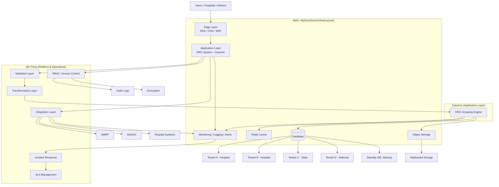

# 🏗️ Master Architecture — National DRG Platform (AWS-Aligned)

## 🎯 Overview

This diagram represents the **complete DRG platform architecture**, showing:

- Infrastructure (AWS / MyGovCloud)
- Application (Casemix)
- Platform & Operations (QK Prima)

---

## 🧱 Master Architecture Diagram

---

## 🧠 Responsibility Summary

| Layer | Owner |
|------|------|
| Infrastructure | AWS / MyGovCloud |
| Application (DRG logic) | Casemix |
| Platform (integration, ops, governance) | QK Prima |

---

## 🔄 Key Flows

### 1. User Access
Users → Edge → Application

---

### 2. Data Flow
Integration → Validation → Transformation → DRG Engine → Storage

---

### 3. Multi-Tenant
Single platform, logically separated data per:
- Hospital
- State
- National

---

### 4. Observability
All layers feed:
- Logs
- Metrics
- Alerts → Incident → SLA

---

### 5. Security
- RBAC enforced at platform layer
- Encryption at all levels
- Full audit trail

---

### 6. Disaster Recovery
- Database replication
- Object storage replication
- Failover capability

---

## 🎯 Design Principles

- AWS-native deployment
- Clear responsibility separation
- Platform-driven operations
- Data-first architecture
- Compliance-ready
- Scalable to national level

---

## 🚀 Final Statement

> AWS provides the foundation.  
> Casemix provides the DRG system.  
> QK Prima ensures the platform runs securely, reliably, and at national scale.
