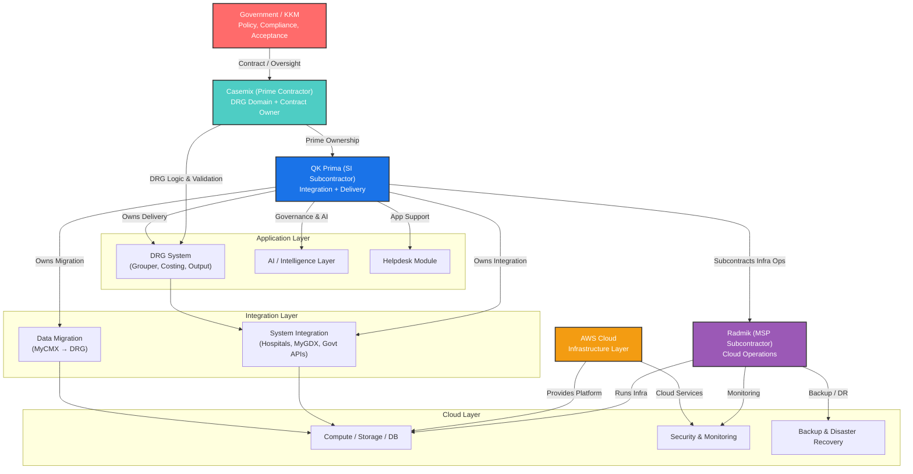

```mermaid
flowchart TB

%% =======================
%% STYLES
%% =======================
classDef govt fill:#FF6B6B,color:#fff,stroke:#333,stroke-width:2px;
classDef casemix fill:#4ECDC4,color:#fff,stroke:#333,stroke-width:2px;
classDef qkprima fill:#1A73E8,color:#fff,stroke:#333,stroke-width:2px;
classDef radmik fill:#9B59B6,color:#fff,stroke:#333,stroke-width:2px;
classDef aws fill:#F39C12,color:#fff,stroke:#333,stroke-width:2px;

%% =======================
%% CORE ENTITIES
%% =======================
Govt["Government / KKM<br>Policy, Compliance, Acceptance"]
Casemix["Casemix (Prime Contractor)<br>DRG Domain + Contract Owner"]
QKPrima["QK Prima (SI Subcontractor)<br>Integration + Delivery"]
Radmik["Radmik (MSP Subcontractor)<br>Cloud Operations"]
AWS["AWS Cloud<br>Infrastructure Layer"]

%% =======================
%% APPLICATION LAYER
%% =======================
subgraph Application Layer
    DRG["DRG System<br>(Grouper, Costing, Output)"]
    AI["AI / Intelligence Layer"]
    Helpdesk["Helpdesk Module"]
end

%% =======================
%% INTEGRATION LAYER
%% =======================
subgraph Integration Layer
    Integration["System Integration<br>(Hospitals, MyGDX, Govt APIs)"]
    Migration["Data Migration<br>(MyCMX → DRG)"]
end

%% =======================
%% CLOUD LAYER
%% =======================
subgraph Cloud Layer
    Infra["Compute / Storage / DB"]
    Security["Security & Monitoring"]
    DR["Backup & Disaster Recovery"]
end

%% =======================
%% RELATIONSHIPS (TOP DOWN)
%% =======================

Govt -->|Contract / Oversight| Casemix

Casemix -->|Prime Ownership| QKPrima
Casemix -->|DRG Logic & Validation| DRG

QKPrima -->|Owns Integration| Integration
QKPrima -->|Owns Migration| Migration
QKPrima -->|Owns Delivery| DRG
QKPrima -->|Governance & AI| AI
QKPrima -->|App Support| Helpdesk

QKPrima -->|Subcontracts Infra Ops| Radmik

Radmik -->|Runs Infra| Infra
Radmik -->|Monitoring| Security
Radmik -->|Backup / DR| DR

AWS -->|Provides Platform| Infra
AWS -->|Cloud Services| Security

%% =======================
%% DATA FLOW
%% =======================
DRG --> Integration
Integration --> Infra
Migration --> Infra

%% =======================
%% CLASS ASSIGNMENT
%% =======================
class Govt govt;
class Casemix casemix;
class QKPrima qkprima;
class Radmik radmik;
class AWS aws;
```
