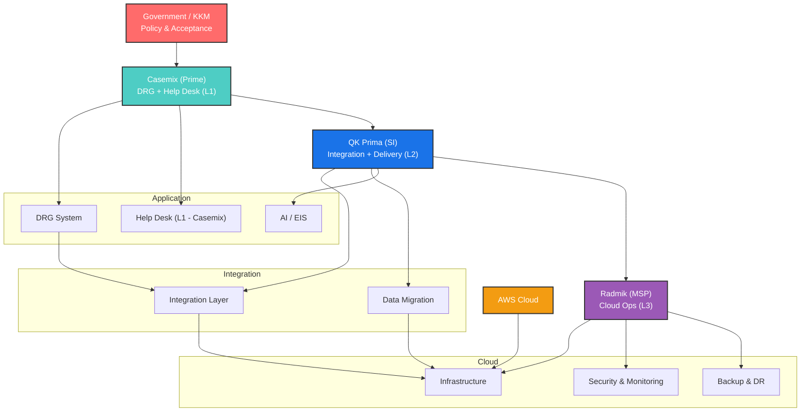

# 🔷 MASTER RESPONSIBILITY MATRIX

## DRG / Casemix on AWS (Tender-Aligned)

### Legend

* **P** = Primary Owner
* **S** = Supporting
* **O** = Oversight

---

## 1. Governance & Ownership

| Function                 | Govt  | Casemix | QK Prima | Radmik |
| ------------------------ | ----- | ------- | -------- | ------ |
| Policy & Compliance      | **P** | S       | —        | —      |
| Prime Contract Ownership | O     | **P**   | —        | —      |
| Program Governance       | O     | **P**   | **S**    | —      |
| Stakeholder Coordination | **P** | **P**   | S        | —      |
| SLA Definition           | O     | **P**   | S        | S      |

---

## 2. Application & DRG Layer

| Function               | Govt | Casemix | QK Prima | Radmik |
| ---------------------- | ---- | ------- | -------- | ------ |
| DRG Logic / Grouper    | O    | **P**   | —        | —      |
| Case-Based Costing     | O    | **P**   | S        | —      |
| DRG Output / Reporting | O    | **P**   | S        | —      |
| AI / EIS Layer         | —    | S       | **P**    | —      |
| Application Features   | —    | **P**   | S        | —      |

---

## 3. Integration & Migration

| Function                     | Govt | Casemix | QK Prima | Radmik |
| ---------------------------- | ---- | ------- | -------- | ------ |
| System Integration           | O    | S       | **P**    | —      |
| Data Migration (MyCMX → DRG) | O    | **P**   | **P**    | S      |
| Data Validation              | O    | **P**   | S        | —      |
| API Orchestration            | —    | —       | **P**    | S      |

---

## 4. Cloud & Infrastructure

| Function               | Govt | Casemix | QK Prima | Radmik |
| ---------------------- | ---- | ------- | -------- | ------ |
| AWS Infrastructure     | —    | —       | S        | **P**  |
| Compute / Storage / DB | —    | —       | S        | **P**  |
| Backup & DR            | O    | —       | S        | **P**  |
| Monitoring             | —    | —       | S        | **P**  |
| Security (Technical)   | O    | S       | S        | **P**  |

---

## 5. Help Desk & Support (UPDATED – CRITICAL)

| Function                  | Govt | Casemix | QK Prima | Radmik |
| ------------------------- | ---- | ------- | -------- | ------ |
| Help Desk (Primary)       | O    | **P**   | S        | —      |
| DRG Coding Support        | —    | **P**   | —        | —      |
| User Training Support     | —    | **P**   | S        | —      |
| Application Issue Support | —    | S       | **P**    | S      |
| Infrastructure Support    | —    | —       | S        | **P**  |

---

## 6. Testing, Deployment & Handover

| Function           | Govt  | Casemix | QK Prima | Radmik |
| ------------------ | ----- | ------- | -------- | ------ |
| Deployment         | —     | S       | **P**    | S      |
| UAT / PAT / FAT    | **P** | S       | **P**    | —      |
| Training           | —     | **P**   | S        | —      |
| Knowledge Transfer | O     | **P**   | **P**    | S      |
| Final Acceptance   | **P** | S       | **P**    | —      |

---

# 🔷 SUPPORT MODEL (VERY POWERFUL FOR TENDER)

## L1 / L2 / L3 STRUCTURE

| Level          | Owner        | Scope                                 |
| -------------- | ------------ | ------------------------------------- |
| **L1 Support** | **Casemix**  | DRG coding, user queries, training    |
| **L2 Support** | **QK Prima** | Application issues, integration, bugs |
| **L3 Support** | **Radmik**   | Infrastructure, AWS, performance      |

---

## 🔥 Positioning Statement (Use in Proposal)

> “The support model follows a structured multi-tier approach where Casemix provides Level 1 DRG-functional support, QK Prima provides Level 2 application and integration support, and Radmik provides Level 3 infrastructure and cloud support.”

---

# 🎯 DIAGRAM

---

# 🔥 FINAL STRATEGIC POSITIONING

### ✔ Casemix

* Prime contractor
* DRG authority
* Help Desk (L1 owner)

### ✔ QK Prima (YOU)

* System Integrator
* Migration + Integration owner
* Application support (L2)
* Delivery backbone

### ✔ Radmik

* MSP
* Infrastructure + cloud (L3)

---

# 🚀 FINAL TAKEAWAY

This version now:

✔ Aligns with tender expectations
✔ Protects you from DRG liability
✔ Keeps you critical (integration + delivery)
✔ Keeps Casemix strong (domain + helpdesk)
✔ Keeps Radmik scoped (MSP only)
