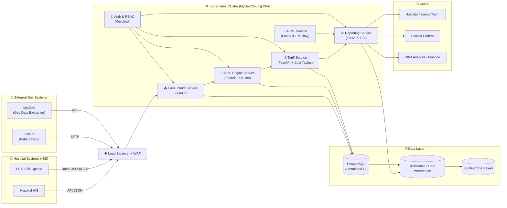

Perfect 👍 — let me give you a **microservices architecture diagram** in Markdown using Mermaid (which renders nicely in many docs, GitHub, Notion, etc.).

This shows how **FastAPI-based microservices** sit behind the **Load Balancer + Kubernetes**, and how they connect to HIS, SMRP, MyGDX, and databases.

---

---

### 🔑 What this shows:

* **Hospitals** send data via **API or SFTP** → goes through **Load Balancer + WAF**.
* Inside **K8s on MyGovCloud**, you have **FastAPI microservices**:

  * Case Intake
  * DRG Engine
  * Tariff Engine
  * Reporting & Analytics
  * AI/ML (optional, anomaly detection, auto-coding)
  * Auth/RBAC via Keycloak.
* **Data Layer:** PostgreSQL (transactional), ClickHouse (analytics), S3/MinIO (data lake).
* **Users:** Hospital finance & coders get DRG/tariff results; KKM gets national analytics.
* **External Systems:** SMRP and MyGDX integrate at the edge.

---

👉 Would you like me to also prepare a **C4 Container Diagram (Context + Container)** version (more formal for tender submission) so you can show high-level (KKM ↔ Hospitals ↔ DRG System) and then deep dive into microservices?
