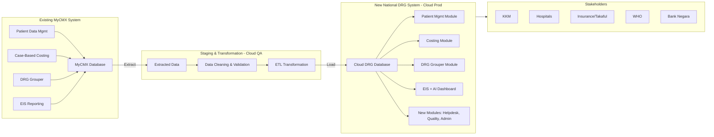
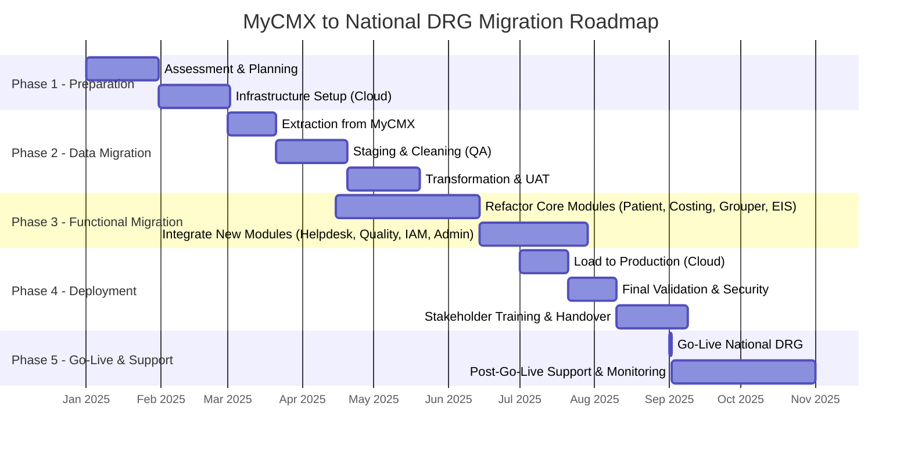

Perfect. Let’s merge the **two perspectives** (functional migration + data migration) into one unified plan, so it’s clear for both technical and stakeholder audiences.

---

# **Unified MyCMX → National DRG System Migration Plan**

## **1. Functional Migration (Modules)**

The following **MyCMX modules** will be refactored and migrated into the new National DRG system:

* **Patient Data Management**

  * Inpatient, Daycare, Outpatient, ED, Domiciliary, Mental Health, Rehabilitation
  * Reports, Audit, Integration, Validation

* **Case-Based Costing**

  * Department & Hospital level costing
  * Top-down, Ratio, Cost-center approaches
  * Reports, Validation, Integration

* **DRG Grouper**

  * Adult IP Algorithm
  * Neonate Algorithm
  * Specialist Outpatient, General Outpatient
  * Daycare, Emergency, Domiciliary
  * Rehabilitation, Palliative, Mental Health

* **Executive Information System (EIS)**

  * Dynamic Reports & Visualisation
  * Machine Learning Predictions

---

## **2. Data Migration**

The following **data types** from MyCMX will be migrated into the new **Cloud DRG Database**:

1. **Patient Data**
2. **Diagnosis Data**
3. **Treatment & Procedure Data**
4. **Financial Data**

### **Migration Methodology**

* **Step 1 – Extraction**
  Extract data from MyCMX Production DB.
* **Step 2 – Staging/Transformation**
  Store data in staging (cloud QA), clean, validate (UAT), transform.
* **Step 3 – Load to Production**
  Migrate validated data into new cloud environment (CFA/CWA).
* **Tools**: ETL + Cloud Migration Software.

---

## **3. Supporting Infrastructure**

* **Interoperability** via HL7 FHIR
* **Security & Identity Access Management**
* **Admin Tools & Monitoring**
* **API Integration** for hospitals, insurers, KKM

---

## **4. Stakeholders**

* **MOH Malaysia (KKM)**
* **Private & University Hospitals**
* **Insurance/Takaful**
* **WHO** (global reporting)
* **Bank Negara Malaysia** (financial oversight)

---

# **Unified Migration Flow Diagram**

---

✅ **This unified plan shows**:

* **Which modules** from MyCMX move into the new system.
* **Which data** is migrated.
* **How migration is executed** (ETL pipeline).
* **Who consumes the outputs** (KKM, hospitals, insurers, WHO).

---

# **Comparison: Old MyCMX vs New National DRG System**

| **Aspect**                | **MyCMX (Existing System)**                                                                                                                                                                         | **New National DRG System (Target State)**                                                                                                                                                                                                            |
| ------------------------- | --------------------------------------------------------------------------------------------------------------------------------------------------------------------------------------------------- | ----------------------------------------------------------------------------------------------------------------------------------------------------------------------------------------------------------------------------------------------------- |
| **Deployment**            | On-premise (production servers at MOH)                                                                                                                                                              | Cloud-based (MyGovCloud@CFA, staging + production)                                                                                                                                                                                                    |
| **Core Modules**          | - Patient Data Management (IP, OP, Daycare, ED, etc.) - Case-Based Costing - DRG Grouper (Adult, Neonate, Outpatient, etc.) - Executive Information System (EIS Reporting & Visualisation) | - Patient Data Management (expanded) - Case-Based Costing (enhanced) - DRG Grouper (refactored algorithms) - EIS & AI (dashboards, ML prediction) - New Modules: Helpdesk, Quality Performance, Identity & Access Management, Admin Tools |
| **Data Types Managed**    | Patient records, Diagnosis, Treatments, Financials                                                                                                                                                  | Same data migrated, plus enhanced codification (ICD-10, ICD-11, ICD-9-CM, ICHI), more structured outputs                                                                                                                                              |
| **Technology Stack**      | Legacy, limited integration                                                                                                                                                                         | Modern APIs, HL7 FHIR, cloud ETL, microservices-ready                                                                                                                                                                                                 |
| **Reporting**             | Static & manual reports                                                                                                                                                                             | Dynamic dashboards, AI-driven insights, real-time outputs                                                                                                                                                                                             |
| **Integration**           | Limited HIS & middleware integration                                                                                                                                                                | Full integration with HIS, middleware (SMRP, MyGDX), finance systems, insurance, WHO                                                                                                                                                                  |
| **Security**              | Basic, local server protections                                                                                                                                                                     | Cloud-native security, IAM, auditing, DR site                                                                                                                                                                                                         |
| **Scalability**           | Limited by physical infra                                                                                                                                                                           | Elastic, scalable cloud environment                                                                                                                                                                                                                   |
| **Stakeholder Access**    | Primarily MOH internal                                                                                                                                                                              | Multi-stakeholder (MOH, private hospitals, university hospitals, insurance, WHO, Bank Negara)                                                                                                                                                         |
| **Migration Requirement** | System aging, requires refactoring                                                                                                                                                                  | Cloud-first, future-ready with AI/ML & analytics                                                                                                                                                                                                      |

---

## **Summary**

* **Modules 1, 2, 3, and part of 6 from MyCMX** are **migrated/refactored** into the new DRG.
* **New modules** (Helpdesk, Quality Performance, Admin Tools, Identity Management) are **added**.
* **Data migration** ensures Patient, Diagnosis, Treatment, and Financial data are carried forward.
* **Infrastructure** shifts from on-premise to **secure, scalable cloud (MyGovCloud@CFA)**.

---

# **Migration Roadmap (MyCMX → National DRG System)**

---

## **Narrative Walkthrough**

* **Phase 1 (Preparation)**

  * Assess MyCMX modules and data scope
  * Stand up cloud infra (staging + prod in MyGovCloud@CFA)

* **Phase 2 (Data Migration)**

  * Extract data (Patient, Diagnosis, Treatment, Finance)
  * Clean, validate, transform in QA environment
  * Run UAT with stakeholders

* **Phase 3 (Functional Migration)**

  * Refactor Patient Mgmt, Costing, DRG Grouper, and EIS modules
  * Add new modules: Helpdesk, Quality Performance, IAM, Admin Tools

* **Phase 4 (Deployment)**

  * Load validated data into Cloud Prod
  * Run final checks (validation, security, integration tests)
  * Conduct user training for MOH, hospitals, insurers, WHO

* **Phase 5 (Go-Live & Support)**

  * Switch to new DRG system
  * Monitor performance & provide 2 months of hypercare support

---

✅ This provides a **visual roadmap + timeline narrative** that aligns with both tender requirements and real-world implementation phases.

# Risk & Mitigation Plan — MyCMX → National DRG

## Phase-Wise Risks, Mitigations, Owners, and Go/No-Go Gates

### Phase 1 — Preparation (Assessment & Cloud Setup)

* **Risk:** Incomplete scope (hidden legacy jobs/interfaces).
  **Mitigation:** 4-week discovery with system inventory, interface catalog, data lineage; sign-off baseline.
  **Owner:** PMO + Enterprise Architect.
  **Gate:** Approved Scope & Architecture Decision Record (ADR) pack.

* **Risk:** Environment readiness delays (network/VPN, VPC, IAM).
  **Mitigation:** Pre-provision IaC (Terraform) blueprints; dry-run in sandbox; parallel security review.
  **Owner:** Cloud Lead + SecOps.
  **Gate:** “Green” infra checklist (CIDR, subnets, SGs, KMS, backups, logging).

* **Risk:** Regulatory misalignment (PDPA/HIPAA-like controls).
  **Mitigation:** Compliance control mapping (PDPA, MOH), DPIA, data minimization policy.
  **Owner:** Compliance Officer.
  **Gate:** DPIA sign-off; data classification matrix approved.

---

### Phase 2 — Data Migration (Extract → QA/Staging → Transform/UAT)

* **Risk:** Data quality defects (duplicates, invalid codes, missing keys).
  **Mitigation:** DQ ruleset (uniqueness, referential integrity, code-set conformance to ICD/ICHI), automated Great Expectations tests; iterative sampling.
  **Owner:** Data Migration Lead.
  **Gate:** ≥99.5% conformance on critical DQ rules; exceptions <0.5% with remediation plan.

* **Risk:** Throughput/performance bottlenecks during extraction.
  **Mitigation:** Windowed extracts, change-data-capture (CDC) for deltas, throttling, off-peak runs.
  **Owner:** DBA + ETL Engineer.
  **Gate:** Extract SLA ≤ X hrs for full load; ≤ Y min for daily delta.

* **Risk:** Code-set drift (ICD-10/11/ICHI mismatches, local codes).
  **Mitigation:** Crosswalk tables, version pinning, governance for local extensions, audit trail.
  **Owner:** Clinical Coding SME.
  **Gate:** 100% successfully mapped mandatory codes; unresolved <0.2% with disposition.

* **Risk:** UAT ambiguity on reconciliation.
  **Mitigation:** Golden datasets, dual-run reconciliation reports (record counts, financial totals, DRG distribution).
  **Owner:** UAT Manager.
  **Gate:** Reconciliation variance ≤0.1% on financial totals; no P1 defects.

---

### Phase 3 — Functional Migration (Refactor Core + Add New Modules)

* **Risk:** Regression in DRG results post-refactor.
  **Mitigation:** Baseline grouper outputs vs MyCMX on stratified samples; unit+contract tests; deterministic test harness.
  **Owner:** DRG Algorithm Lead.
  **Gate:** ≥99% match on reference cohorts; discrepancies explained/documented.

* **Risk:** Integration breaks with HIS/middleware/finance.
  **Mitigation:** API contract testing (PACT), mock providers, FHIR profile validation, backward-compatible versions.
  **Owner:** Integration Lead.
  **Gate:** All critical contracts pass CI; zero failing PACT verifications.

* **Risk:** Scope creep (new features during refactor).
  **Mitigation:** Change control board; feature freeze at code-complete; backlog deferral.
  **Owner:** PMO.
  **Gate:** Freeze list signed; variance ≤5%.

---

### Phase 4 — Deployment (Load to Prod, Final Validation, Training)

* **Risk:** Cutover risk (extended downtime, rollback complexity).
  **Mitigation:** Runbook with timed steps, T-minus rehearsals, blue/green or canary by hospital cohort, rollback artifacts pre-staged.
  **Owner:** Release Manager.
  **Gate:** Two successful dry runs; RTO/RPO validated; rollback <30 min.

* **Risk:** Security gaps at go-live (IAM, secrets, audit).
  **Mitigation:** Pre-go-live security gate: CIS benchmarks, secret rotation, least privilege review, audit sinks verified.
  **Owner:** SecOps Lead.
  **Gate:** Zero critical findings; pen-test P1/P2 remediated.

* **Risk:** Low adoption/readiness of stakeholders.
  **Mitigation:** Role-based training (MOH, hospitals, insurers), micro-learning, job aids, helpdesk SLAs.
  **Owner:** Change Manager.
  **Gate:** >90% completion of role training; CSAT ≥4/5 in pilots.

---

### Phase 5 — Go-Live & Hypercare

* **Risk:** Post-go-live stability (performance spikes, data drift).
  **Mitigation:** SRE playbooks, autoscaling policies, error-budget SLOs, anomaly alerts on DRG mix/cost per case.
  **Owner:** SRE Lead.
  **Gate:** 2-week stability trend within SLOs; incident MTTR ≤30 min; no Sev-1.

* **Risk:** Support overload.
  **Mitigation:** Tiered support, knowledge base, hotfix cadence, weekly CAB.
  **Owner:** Support Manager.
  **Gate:** Backlog burn-down to steady-state within 4 weeks.

---

## Cross-Cutting Risks & Systemic Controls

* **Vendor/third-party dependency risk:** Dual-vendor ETL tooling option; exit clauses; escrowed runbooks.
* **Key-person risk:** Pairing, code reviews, documentation standards, bus-factor ≥2 for every critical domain.
* **Compliance drift:** Quarterly control attestation; automated evidence collection (logs, scans, access reviews).
* **Data privacy:** Pseudonymization in non-prod, field-level encryption, masking pipelines.

---

## Operational KPIs & SLOs (Hypercare → BAU)

* **Availability:** ≥99.9% (monthly).
* **Grouper Consistency:** ≥99% parity vs baseline on control cohorts.
* **DQ Conformance (critical rules):** ≥99.5%.
* **ETL Timeliness:** Full load ≤X hrs; daily delta ≤Y min.
* **Support:** First-response ≤15 min (Sev-1), MTTR ≤30 min.
* **User Adoption:** DAU/MAU ratio ≥35% in month 1; Training completion ≥90%.

---

## Go/No-Go Checklist (Condensed)

* ✅ Infra “green” checklist signed (security, backups, monitoring).
* ✅ Data reconciliation thresholds met (counts, totals, DRG mix).
* ✅ Security gate passed (no criticals).
* ✅ Dual dry-runs successful; rollback tested.
* ✅ Stakeholder training ≥90% completion.
* ✅ Support runbooks & SLAs in force.

---

## RAID Log Template (drop-in Markdown)

| ID    | Type (Risk/Assumption/Issue/Dependency) | Description                         | Impact | Owner     | Status      | Mitigation/Action                       | Due        |
| ----- | --------------------------------------- | ----------------------------------- | ------ | --------- | ----------- | --------------------------------------- | ---------- |
| R-001 | Risk                                    | Data quality variance in OP records | High   | Data Lead | Open        | Tighten DQ rules; re-ingest OP cohort   | 2025-03-12 |
| D-004 | Dependency                              | VPN peering with MOH DC             | High   | NetOps    | In-Progress | Expedite change request; fallback IPSec | 2025-02-05 |

---

## RACI (Illustrative)

* **Accountable:** Program Director (overall), Release Manager (cutover)
* **Responsible:** Data Lead (ETL/DQ), DRG Algorithm Lead, Integration Lead, SRE Lead
* **Consulted:** Clinical Coding SME, Compliance Officer, SecOps
* **Informed:** KKM leadership, Hospital admins, Insurers/WHO

