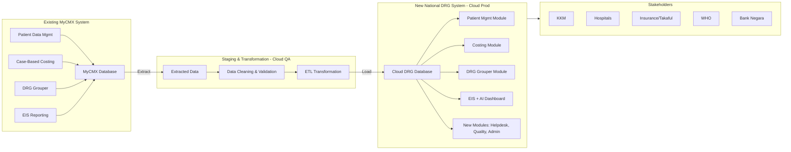

Perfect. Let’s merge the **two perspectives** (functional migration + data migration) into one unified plan, so it’s clear for both technical and stakeholder audiences.

---

# **Unified MyCMX → National DRG System Migration Plan**

## **1. Functional Migration (Modules)**

The following **MyCMX modules** will be refactored and migrated into the new National DRG system:

* **Patient Data Management**

  * Inpatient, Daycare, Outpatient, ED, Domiciliary, Mental Health, Rehabilitation
  * Reports, Audit, Integration, Validation

* **Case-Based Costing**

  * Department & Hospital level costing
  * Top-down, Ratio, Cost-center approaches
  * Reports, Validation, Integration

* **DRG Grouper**

  * Adult IP Algorithm
  * Neonate Algorithm
  * Specialist Outpatient, General Outpatient
  * Daycare, Emergency, Domiciliary
  * Rehabilitation, Palliative, Mental Health

* **Executive Information System (EIS)**

  * Dynamic Reports & Visualisation
  * Machine Learning Predictions

---

## **2. Data Migration**

The following **data types** from MyCMX will be migrated into the new **Cloud DRG Database**:

1. **Patient Data**
2. **Diagnosis Data**
3. **Treatment & Procedure Data**
4. **Financial Data**

### **Migration Methodology**

* **Step 1 – Extraction**
  Extract data from MyCMX Production DB.
* **Step 2 – Staging/Transformation**
  Store data in staging (cloud QA), clean, validate (UAT), transform.
* **Step 3 – Load to Production**
  Migrate validated data into new cloud environment (CFA/CWA).
* **Tools**: ETL + Cloud Migration Software.

---

## **3. Supporting Infrastructure**

* **Interoperability** via HL7 FHIR
* **Security & Identity Access Management**
* **Admin Tools & Monitoring**
* **API Integration** for hospitals, insurers, KKM

---

## **4. Stakeholders**

* **MOH Malaysia (KKM)**
* **Private & University Hospitals**
* **Insurance/Takaful**
* **WHO** (global reporting)
* **Bank Negara Malaysia** (financial oversight)

---

# **Unified Migration Flow Diagram**

---

✅ **This unified plan shows**:

* **Which modules** from MyCMX move into the new system.
* **Which data** is migrated.
* **How migration is executed** (ETL pipeline).
* **Who consumes the outputs** (KKM, hospitals, insurers, WHO).

---

Would you like me to also prepare a **side-by-side comparison table (Old MyCMX vs New DRG System)** for your tender submission? That would make it crystal clear for evaluators.
