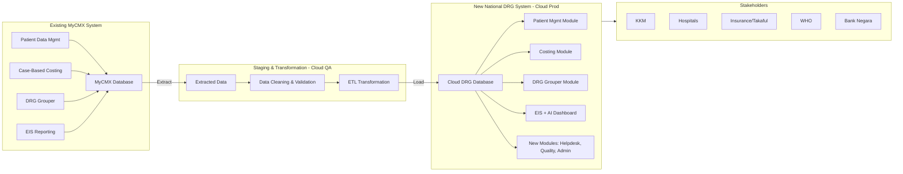

Perfect. Let’s merge the **two perspectives** (functional migration + data migration) into one unified plan, so it’s clear for both technical and stakeholder audiences.

---

# **Unified MyCMX → National DRG System Migration Plan**

## **1. Functional Migration (Modules)**

The following **MyCMX modules** will be refactored and migrated into the new National DRG system:

* **Patient Data Management**

  * Inpatient, Daycare, Outpatient, ED, Domiciliary, Mental Health, Rehabilitation
  * Reports, Audit, Integration, Validation

* **Case-Based Costing**

  * Department & Hospital level costing
  * Top-down, Ratio, Cost-center approaches
  * Reports, Validation, Integration

* **DRG Grouper**

  * Adult IP Algorithm
  * Neonate Algorithm
  * Specialist Outpatient, General Outpatient
  * Daycare, Emergency, Domiciliary
  * Rehabilitation, Palliative, Mental Health

* **Executive Information System (EIS)**

  * Dynamic Reports & Visualisation
  * Machine Learning Predictions

---

## **2. Data Migration**

The following **data types** from MyCMX will be migrated into the new **Cloud DRG Database**:

1. **Patient Data**
2. **Diagnosis Data**
3. **Treatment & Procedure Data**
4. **Financial Data**

### **Migration Methodology**

* **Step 1 – Extraction**
  Extract data from MyCMX Production DB.
* **Step 2 – Staging/Transformation**
  Store data in staging (cloud QA), clean, validate (UAT), transform.
* **Step 3 – Load to Production**
  Migrate validated data into new cloud environment (CFA/CWA).
* **Tools**: ETL + Cloud Migration Software.

---

## **3. Supporting Infrastructure**

* **Interoperability** via HL7 FHIR
* **Security & Identity Access Management**
* **Admin Tools & Monitoring**
* **API Integration** for hospitals, insurers, KKM

---

## **4. Stakeholders**

* **MOH Malaysia (KKM)**
* **Private & University Hospitals**
* **Insurance/Takaful**
* **WHO** (global reporting)
* **Bank Negara Malaysia** (financial oversight)

---

# **Unified Migration Flow Diagram**


---

✅ **This unified plan shows**:

* **Which modules** from MyCMX move into the new system.
* **Which data** is migrated.
* **How migration is executed** (ETL pipeline).
* **Who consumes the outputs** (KKM, hospitals, insurers, WHO).

---

Perfect. Here’s a **clear comparison table** you can drop straight into your GitHub repo, tender documentation, or migration plan.

---

# **Comparison: Old MyCMX vs New National DRG System**

| **Aspect**                | **MyCMX (Existing System)**                                                                                                                                                                         | **New National DRG System (Target State)**                                                                                                                                                                                                            |
| ------------------------- | --------------------------------------------------------------------------------------------------------------------------------------------------------------------------------------------------- | ----------------------------------------------------------------------------------------------------------------------------------------------------------------------------------------------------------------------------------------------------- |
| **Deployment**            | On-premise (production servers at MOH)                                                                                                                                                              | Cloud-based (MyGovCloud@CFA, staging + production)                                                                                                                                                                                                    |
| **Core Modules**          | - Patient Data Management (IP, OP, Daycare, ED, etc.)<br>- Case-Based Costing<br>- DRG Grouper (Adult, Neonate, Outpatient, etc.)<br>- Executive Information System (EIS Reporting & Visualisation) | - Patient Data Management (expanded)<br>- Case-Based Costing (enhanced)<br>- DRG Grouper (refactored algorithms)<br>- EIS & AI (dashboards, ML prediction)<br>- New Modules: Helpdesk, Quality Performance, Identity & Access Management, Admin Tools |
| **Data Types Managed**    | Patient records, Diagnosis, Treatments, Financials                                                                                                                                                  | Same data migrated, plus enhanced codification (ICD-10, ICD-11, ICD-9-CM, ICHI), more structured outputs                                                                                                                                              |
| **Technology Stack**      | Legacy, limited integration                                                                                                                                                                         | Modern APIs, HL7 FHIR, cloud ETL, microservices-ready                                                                                                                                                                                                 |
| **Reporting**             | Static & manual reports                                                                                                                                                                             | Dynamic dashboards, AI-driven insights, real-time outputs                                                                                                                                                                                             |
| **Integration**           | Limited HIS & middleware integration                                                                                                                                                                | Full integration with HIS, middleware (SMRP, MyGDX), finance systems, insurance, WHO                                                                                                                                                                  |
| **Security**              | Basic, local server protections                                                                                                                                                                     | Cloud-native security, IAM, auditing, DR site                                                                                                                                                                                                         |
| **Scalability**           | Limited by physical infra                                                                                                                                                                           | Elastic, scalable cloud environment                                                                                                                                                                                                                   |
| **Stakeholder Access**    | Primarily MOH internal                                                                                                                                                                              | Multi-stakeholder (MOH, private hospitals, university hospitals, insurance, WHO, Bank Negara)                                                                                                                                                         |
| **Migration Requirement** | System aging, requires refactoring                                                                                                                                                                  | Cloud-first, future-ready with AI/ML & analytics                                                                                                                                                                                                      |

---

## **Summary**

* **Modules 1, 2, 3, and part of 6 from MyCMX** are **migrated/refactored** into the new DRG.
* **New modules** (Helpdesk, Quality Performance, Admin Tools, Identity Management) are **added**.
* **Data migration** ensures Patient, Diagnosis, Treatment, and Financial data are carried forward.
* **Infrastructure** shifts from on-premise to **secure, scalable cloud (MyGovCloud@CFA)**.

---
```mermaid
gantt
    title MyCMX to National DRG Migration Roadmap
    dateFormat  YYYY-MM-DD
    axisFormat  %b %Y
    section Phase 1 - Preparation
    Assessment & Planning      :a1, 2025-01-01, 30d
    Infrastructure Setup (Cloud) :a2, after a1, 30d

    section Phase 2 - Data Migration
    Extraction from MyCMX      :b1, 2025-03-01, 20d
    Staging & Cleaning (QA)    :b2, after b1, 30d
    Transformation & UAT       :b3, after b2, 30d

    section Phase 3 - Functional Migration
    Refactor Core Modules (Patient, Costing, Grouper, EIS) :c1, 2025-04-15, 60d
    Integrate New Modules (Helpdesk, Quality, IAM, Admin) :c2, after c1, 45d

    section Phase 4 - Deployment
    Load to Production (Cloud) :d1, 2025-07-01, 20d
    Final Validation & Security :d2, after d1, 20d
    Stakeholder Training & Handover :d3, after d2, 30d

    section Phase 5 - Go-Live & Support
    Go-Live National DRG       :e1, 2025-09-01, 1d
    Post-Go-Live Support & Monitoring :e2, after e1, 60d
